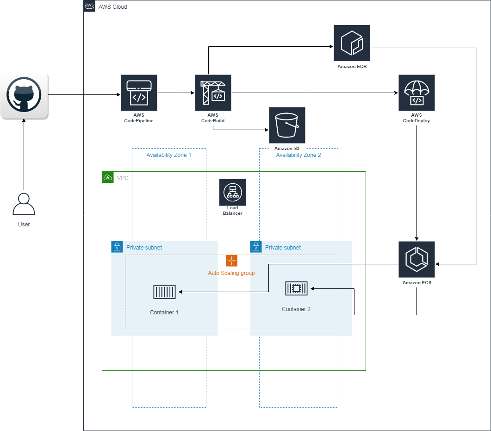

# Terraform Module Name: terraform-aws-ecs-cd-code-pipeline

AWS ECS Continuous Deployment (Blue/Green) with AWS CodePipeline in Terraform.

With this new capability, we can create a new service in AWS Fargate or Amazon ECS  that uses CodeDeploy to manage the deployments, testing, and traffic cutover for you. When you make updates to your service, CodeDeploy triggers a deployment. This deployment, in coordination with Amazon ECS, deploys the new version of your service to the green target group, updates the listeners on your load balancer to allow you to test this new version, and performs the cutover if the health checks pass.


## General

AWS ECS Continuous Deployment (Blue/Green) with AWS CodePipeline in Terraform
This module create following resources in AWS cloud provider..

---


## Prerequisites

This module needs Terraform 0.11.14 or newer.
You can download the latest Terraform version from [here](https://www.terraform.io/downloads.html).

This module deploys aws services details are in respective feature branches.

---

## Features Branches

Below we are able to check the resources that are being created as part of this module call:

From branch : **_terraform-11/master_**

- **_Code Pipline_**
- **_Code Build_**
- **_Code Deploy_**
- **_VPC_**
- **_S3_**
- **_ECS CLuster (EC2 Model)_**
- **_Auto Scalling Group_**
- **_Launch Template_**
- **_ECS Task Definition_**
- **_ECS Service (nginx)_**
- **_Application Load Balancer_**


From branch : **_terrform-12/master (Not yet started)_**

- **_Code Pipline_**
- **_Code Build_**
- **_Code Deploy_**
- **_VPC_**
- **_S3_**
- **_ECS CLuster (EC2 Model)_**
- **_Auto Scalling Group_**
- **_Launch Template_**
- **_ECS Task Definition_**
- **_ECS Service (nginx)_**
- **_Application Load Balancer_**

---


## Usage

## Using this repo

To use this module, add the following call to your code:

```tf
git clone https://github.com/nitinda/terraform-aws-ecs-cd-code-pipeline.git?ref=terraform-11/master
cd terraform-aws-ecs-cd-code-pipeline
export GITHUBTOKEN="*********"                      ## GitHub API Token
make plan
make apply
```
---

## Inputs

The variables required in order for the module to be successfully called from the deployment repository are the following:


|         **_Variable_**          |        **_Description_**            |   **_Type_**   |
|---------------------------------|-------------------------------------|----------------|


## Outputs

- **_alb\_dns\_name_**


## Diagram




## Authors
Module maintained by Module maintained by the - **_Nitin Das_**